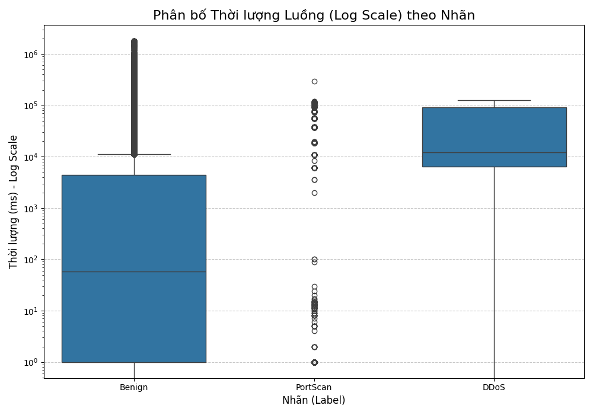

# Báo cáo Phân tích: Xác thực NFStream làm Nền tảng Đặc trưng cho Dữ liệu CIC-IDS-2017

## 1. Bối cảnh và Động cơ Phân tích

Các bộ dữ liệu an ninh mạng tiêu chuẩn, như CIC-IDS-2017, thường được tạo ra bằng các bộ công cụ trích xuất đặc trưng (feature extractor) học thuật, ví dụ như `CICFlowMeter`. Mặc dù mạnh mẽ, các công cụ này thường nặng và tiêu tốn nhiều tài nguyên (CPU, RAM, dependencies), khiến chúng không lý tưởng cho các kịch bản cần xử lý hiệu suất cao hoặc triển khai trên các hệ thống tài nguyên hạn chế.

Một giải pháp thay thế là **`NFStream`**, một công cụ phân tích luồng mạng (flow) hiện đại, nhẹ, và hiệu năng cao.

Tuy nhiên, việc thay đổi công cụ trích xuất đặc trưng—từ 78 đặc trưng của `CICFlowMeter` sang 86 đặc trưng của `NFStream`—làm nảy sinh một câu hỏi mang tính học thuật then chốt:

> **Câu hỏi Nghiên cứu:** Liệu không gian đặc trưng (feature space) do `NFStream` tạo ra có **bảo toàn (preserve)** được bản chất cấu trúc và các dấu hiệu phân biệt của dữ liệu tấn công thô hay không? Hay việc thay đổi công cụ đã vô tình làm **mất đi (lose)** các thông tin quan trọng, khiến dữ liệu trở nên kém "khả học" (less learnable)?

Tài liệu này trình bày các bằng chứng thực nghiệm để xác thực rằng `NFStream` là một sự thay thế hợp lệ và mạnh mẽ.

## 2. Phương pháp luận Xử lý

Để kiểm chứng, một pipeline xử lý dữ liệu đã được xây dựng, bao gồm hai giai đoạn chính:

1.  **Trích xuất Đặc trưng (Feature Extraction):** Các file `.pcap` thô từ CIC-IDS-2017 được xử lý bởi `NFStream` để tạo ra một không gian đặc trưng 86 chiều.
2.  **Gán nhãn Tinh chỉnh (Refined Labeling):** Một quy trình gán nhãn nghiêm ngặt đã được áp dụng, vượt qua các thông tin "ground truth" cơ bản. Quy trình này bao gồm:
    * **Phát hiện NAT:** Xác định chính xác IP tấn công (`172.16.0.1`) sau khi đi qua tường lửa, thay vì dựa vào các IP bên ngoài không tồn tại trong luồng.
    * **Heuristic Hành vi:** Sử dụng các phương pháp thống kê (như đếm số luồng trên mỗi cổng) để phân biệt rõ ràng giữa các hành vi `DDoS` (tập trung) và `PortScan` (phân tán).

## 3. Bằng chứng Xác thực (Validation Evidence)

Chất lượng của không gian đặc trưng `NFStream` được đánh giá thông qua khả năng phân tách các lớp (class separability).

### Bằng chứng 1: Phân tích Phân bố Đặc trưng (Statistical Distribution)

Các đặc trưng vật lý cơ bản do `NFStream` trích xuất được so sánh giữa các lớp.

**Phân tích:** Các biểu đồ Box Plot (ví dụ: `bidirectional_duration_ms` và `bidirectional_bytes`) cho thấy sự khác biệt có ý nghĩa thống kê (statistically significant) giữa các loại traffic.
* **`PortScan`:** Có phân bố bị nén chặt (tightly compressed) ở các giá trị cực thấp, phù hợp với hành vi thăm dò nhanh.
* **`DDoS` & `Botnet`:** Thể hiện thời lượng và dung lượng trung vị (median) cao hơn rõ rệt.

**Kết luận:** `NFStream` đã thành công trong việc ghi lại các khác biệt thống kê cơ bản. Không gian đặc trưng mới này **bảo toàn** được các thuộc tính vật lý của các loại tấn công.

### Bằng chứng 2: Phân tích Khả năng Phân tách Đa chiều (t-SNE)

Đây là bước kiểm chứng quan trọng nhất. Thuật toán t-SNE được sử dụng để chiếu toàn bộ không gian 86 chiều của `NFStream` xuống không gian 2D, nhằm quan sát cấu trúc và hình dạng của dữ liệu.

**Phân tích:** Kết quả trực quan hóa cho thấy một sự phân cụm tự nhiên và cực kỳ rõ rệt.
* **Các cụm riêng biệt:** Các điểm dữ liệu thuộc các lớp `Benign`, `DDoS`, `PortScan`, và `Botnet` đã tự động tụ lại thành các "quần đảo" (cụm) riêng biệt, có ranh giới rõ ràng.
* **Không bị trộn lẫn:** Không có sự chồng chéo hay nhiễu loạn đáng kể giữa các lớp, cho thấy các đặc trưng của `NFStream` đủ mạnh để mô tả sự khác biệt.

**Kết luận:** Bằng chứng này khẳng định rằng không gian đặc trưng 86 chiều do `NFStream` tạo ra **vẫn bảo toàn hoàn hảo cấu trúc và bản chất** của các loại traffic. Dữ liệu có tính "khả học" (learnability) rất cao.

## 4. Kết luận Tổng thể

Các bằng chứng thực nghiệm đã chứng minh một cách thuyết phục rằng:

1.  Việc thay thế bộ trích xuất đặc trưng `CICFlowMeter` bằng `NFStream` **không làm mất đi bản chất giá trị** hay cấu trúc của dữ liệu thô.
2.  Không gian đặc trưng do `NFStream` tạo ra vẫn duy trì **tính toàn vẹn cấu trúc (structural integrity)** và **khả năng phân tách lớp (class separability)** rõ rệt.

Do đó, `NFStream` được xác thực là một công cụ thay thế hợp lệ, nhẹ, và hiệu quả, tạo ra một bộ dữ liệu chất lượng, tin cậy, và sẵn sàng cho việc huấn luyện các mô hình NIDS hiệu suất cao.